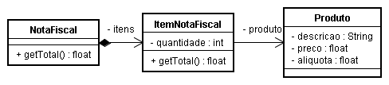

### Objetivo
Calcular o total de uma nota fiscal exige iterar por cada um dos itens, 
obter a quantidade de produtos do item, multiplicar pelo preço de cada 
item e acrescentar uma alíquota (percentual) correspondente ao imposto 
do produto em questão, o que resulta no total parcial correspondente ao 
item e a ser acumulado para todos os itens, resultando no valor total da nota. 
       
### PROPOSTA DE SOLUÇÃO
Observe que é razoável a identificação das classes NotaFiscal, ItemNotaFiscal e Produto. 
Conforme ilustrado abaixo, as informações associadas às classes são suficientes
para o propósito do método `getTotal()` da classe NotaFiscal. 

### Pseudocódigo

#### Método getTotal() (NotaFiscal)
Para cada item de itens (item da nota fiscal) faça:
	Acumule em total o valor obtido da mensagem getTotal() enviada para o item
	Retorne o valor acumulado em total
	
#### Método getTotal() (ItemNotaFiscal)
	Recupere o preço do produto referenciado pelo item (preço)
	Recupere a alíquota do produto referenciado pelo item (alíquota)
	Calcule precoComImposto = preço * (1 + alíquota)
	Calcule total do item: quantidade * precoComImposto 
