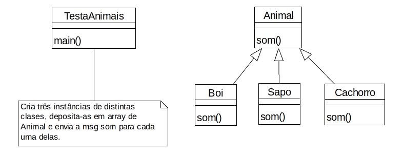

### Objetivo

Modele e implemente o que está detalhado abaixo.

### Problema

1. Crie a classe Animal. Esta classe deve possuir um único método: som. Este método não recebe nenhum valor como argumento e, quando executado, deverá retornar a sequência de caracteres “Voz produzida pelo animal” (sem as aspas, claro). A classe Animal não é abstrata. Não forneça construtor para a classe Animal. Esta classe também não deve possuir nenhum atributo.
1. Crie a classe Sapo e faça a sobreposição (overriding) do método som, que deve retornar uma seqüência de caracteres correspondente ao som produzido por este tipo de animal, no caso, “coaxar”. Sobreposição ou overridding refere-se ao cenário onde um método de uma subclasse possui exatamente a mesma assinatura de um método da superclasse e, dessa forma, há uma sobreposição do método da superclasse.
1. Crie a classe Cachorro que herda da classe Animal. Implemente o método som. O retorno deve ser “latir”. O retorno também pode ser “ladrar” ou “ganir”.
1. Crie a classe Boi e implemente o método som, cujo retorno deverá ser “berrar” ou “mugir”. Novamente, esta classe também estende a classe Animal.
1. Crie uma quinta classe: TestaAnimais. Esta classe deverá conter o código que testa as classes identificadas acima. Quando executada, esta classe deverá:
   1. Criar um array de três componentes. Cada componente do array deverá ser uma referência para um objeto da classe Animal. Entenda objeto da classe Animal como sendo todo e qualquer objeto que pode se comportar como uma instância desta classe. Por exemplo, toda instância de uma subclasse de Animal pode se comportar como um objeto da classe Animal.
   1. Crie uma instância de cada um dos animais, ou seja, uma instância de Sapo, uma de Cachorro e outra de Boi. Deposite a referência correspondente em uma posição do array criado pelo item anterior. Ou seja, todas as instâncias criadas serão referenciadas, cada uma delas, por um dos componentes do array.
   1. Crie um laço que percorra os elementos do array e para cada um deles envie a mensagem polimórfica som. Ou seja, cada referência armazenada no array designa um objeto para o qual será enviada a mensagem som.

### Proposta



### Código

#### Animal

```java
package poo1;

public class Animal {

    public String som() {
        return "Voz produzida pelo animal";
    }
}
```
