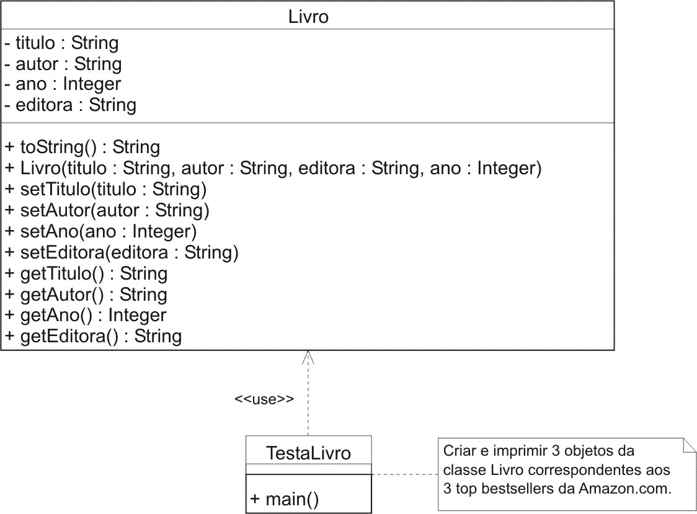

### Objetivo

Crie um modelo e código correspondentes aos seguintes itens. Execute o programa correspondente e observe os resultados.

### Restrições
1. Crie a classe Livro. Esta classe deve possuir os atributos titulo, autor, ano e editora. O titulo é o nome da obra (seqüência de caracteres). O segundo destes atributos deve ser uma seqüência de caracteres correspondente ao autor da obra em questão. O ano deve ser um inteiro representando o ano de publicação do livro e editora uma seqüência de caracteres correspondente ao nome da editora.
1. Crie métodos set/get que permitam definir um valor e obtê-lo, para cada propriedade desta classe. Estes métodos seguem regras de formação bem definidas. Por exemplo, para a propriedade autor, os métodos correspondentes devem ser identificados por setAutor e getAutor. 
1. Crie a classe TestaLivro. Esta classe deverá criar uma instância para cada um dos três livros mais vendidos pela Amazon. Posteriormente, o estado de cada instância deverá ser exibido na saída padrão. Em tempo, Amazon é uma das prinipais livrarias virtuais do planeta. Os bestsellers desta livraria podem ser obtidos em www.amazon.com.
1. Uma abordagem freqüente para exibir o estado de uma instância, ou seja, os valores das propriedades da instância, emprega o método String toString(). Este método é herdado da classe Object e, por conseguinte, o emprego dele exige que a classe derivada faça uma sobreposição. Convém ressaltar que, em Java, toda classe herda de Object, inclusive arrays. 
1. No momento em que este texto foi feito o número um da lista era The Da Vince Code, Dan Brown, publicado pela editora Doubleday em 2003. Para esta instância a saída correspondente a ser produzida deve se assemelhar ao que se vê abaixo:
    ```
    The Da Vince Code
    Dan Brown
    Doubleday, 2003
    ```

### Modelo



### Código

#### TestaLivro
```java
package poo2;

public class TestaLivro {

    public static void main(String[] args) {
        Livro l1 = new Livro("Title 1", "Author 1", "Press 1", 2004);
        Livro l2 = new Livro("Title 2", "Author 2", "Press 2", 2004);
        Livro l3 = new Livro("Title 3", "Author 3", "Press 3", 2004);

        System.out.println(l1 + "\n");
        System.out.println(l2 + "\n");
        System.out.println(l3 + "\n");
    }
}
```

#### Livro
```java
package poo2;

public class Livro {
    private String titulo;
    private String autor;
    private String editora;
    private int ano;

    public Livro(String titulo, String autor, String editora, int ano) {
        setTitulo(titulo);
        setAutor(autor);
        setEditora(editora);
        setAno(ano);
    }

    public int getAno() {
        return ano;
    }

    public void setAno(int ano) {
        this.ano = ano;
    }

    public String getAutor() {
        return autor;
    }

    public void setAutor(String autor) {
        this.autor = autor;
    }

    public String getTitulo() {
        return titulo;
    }

    public void setTitulo(String titulo) {
        this.titulo = titulo;
    }

    public String toString() {
        return getTitulo() + "\n" + getAutor() + "\n" 
               + getEditora() + ", "+ getAno();
    }

    public String getEditora() {
        return editora;
    }

    public void setEditora(String editora) {
        this.editora = editora;
    }
}
```
