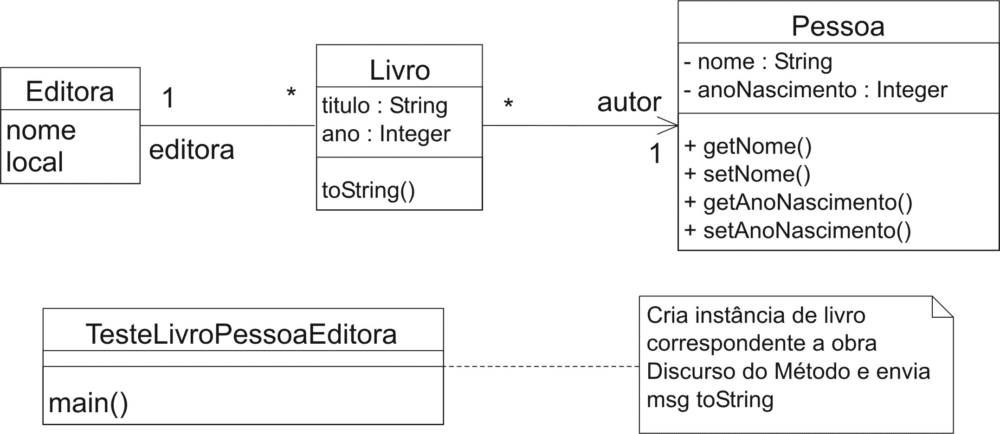

### Objetivo

Crie um modelo e código correspondentes aos seguintes itens. Execute o programa correspondente e observe os resultados.

1. Crie a classe Pessoa. Os atributos de pessoa incluem nome e anoNascimento. Crie métodos para obter e atualizar os valores de cada um destes atributos. Ou seja, crie os métodos setNome, getNome, setAnoNascimento e getAnoNascimento. Estes métodos são geralmente chamados de métodos get/set. Eles são tão freqüentes que praticamente todo ambiente integrado de desenvolvimento como o Eclipse, por exemplo, oferece recurso para gerá-los automaticamente, com a mesma regra para a nomeação deles conforme empregado acima. 
1. Crie a classe Livro. Esta classe deve possuir os atributos titulo, autor, ano e editora. O titulo é o nome da obra (sequência de caracteres). O segundo destes atributos, autor, deve ser uma referência para uma instância da classe Pessoa. Naturalmente, a instância de Pessoa referenciada por este atributo refere-se ao autor da obra em questão. O atributo ano refere-se ao ano de publicação da obra e, por último, editora deve ser uma referência para a classe Editora, descrita no item seguinte.
1. A classe Editora deve possuir como atributos: nome e local (endereço).
1. Crie a classe TesteLivroPessoaEditora. (É isto ái, antes que alguém me pergunte, o nome deve conter toda esta sequência de caracteres.) Quando executada, esta classe deverá criar instâncias de tal forma que represente adequadamente informações sobre livros. Abaixo segue um exemplo de um conjunto de informações que instâncias destas classes deverão representar.
    ```
    Livro: Discurso do Método
    Autor: René Descartes
    Ano de nascimento de René Descartes: 1596
    Ano de impressao desta obra por esta editora: 2002
    Editora: Martin Claret
    Endereço da editora: Rua Alegrete, 62, Bairro Sumaré.
    ```

1. A classe TesteLivroPessoaEditora também deverá imprimir informações correspondentes à instância de Livro criada. Crie o método toString para a classe Livro. Este método não deve possuir argumento de entrada e deve retornar como resultado uma seqüência de caracteres correspondentes às informações do livro em questão. O retorno deste método e a saída produzida pela execução da classe TesteLivroPessoaEditora deverá ser similar àquele abaixo:
    ```
    Discurso do Método
    René Descartes (nascimento: 1596)
    Martin Claret, 2002
    Rua Alegrete, 62, Bairro Sumaré.
    ```

### Modelo



### Código

#### Editora

```java
package poo3;

public class Editora {
    private String nome;
    private String local;

    public Editora(String nome, String local) {
        setNome(nome);
        setLocal(local);
    }

    public String getLocal() {
        return local;
    }

    public void setLocal(String local) {
        this.local = local;
    }

    public String getNome() {
        return nome;
    }

    public void setNome(String nome) {
        this.nome = nome;
    }

    public String toString() {
        return getNome() + "\n" + getLocal();
    }
}
```

#### TesteLivroPessoaEditora

```java
package poo3;

public class TesteLivroPessoaEditora {

    public static void main(String[] args) {
        
        // Cria instância de Pessoa correspondente ao autor
        Pessoa p = new Pessoa("René Descartes", 1596);
        
        // Cria instânca de Editora do livro em questão
        String en = new String("Rua Alegrete, 62, Bairro Sumaré");
        Editora ed = new Editora("Martin Claret", en);
        
        // Cria instância correspondente ao livro desejado
        Livro l = new Livro("Discurso do Método",ed,p,2002);
        
        // Imprime estado da instância de livro criada
        System.out.println(l);
    }
}
```

#### Pessoa
```java
package poo3;

public class Pessoa {
    private String nome;
    private int anoNascimento;
    
    public Pessoa(String nome, int anoNascimento) {
        super(); // Se não fornecida, o compilador insere!
        setNome(nome);
        setAnoNascimento(anoNascimento);
    }
    
    public int getAnoNascimento() {
        return anoNascimento;
    }

    public void setAnoNascimento(int anoNascimento) {
        this.anoNascimento = anoNascimento;
    }

    public String getNome() {
        return nome;
    }

    public void setNome(String nome) {
        this.nome = nome;
    }

    public String toString() {
        return getNome() + " (nascimento: " + getAnoNascimento() + ")";
    }
}
```

#### Livro
```java
package poo3;

public class Livro {
    private String titulo;
    private int ano;
    private Editora editora;
    private Pessoa autor;
    
    public Livro(String titulo, Editora editora, Pessoa autor, int ano) {
        setTitulo(titulo);
        setAno(ano);
        setEditora(editora);
        setAutor(autor);
    }

    public int getAno() {
        return ano;
    }

    public void setAno(int ano) {
        this.ano = ano;
    }

    public Pessoa getAutor() {
        return autor;
    }

    public void setAutor(Pessoa autor) {
        this.autor = autor;
    }

    public Editora getEditora() {
        return editora;
    }

    public void setEditora(Editora editora) {
        this.editora = editora;
    }

    public String getTitulo() {
        return titulo;
    }

    public void setTitulo(String titulo) {
        this.titulo = titulo;
    }
    
    public String toString() {
        return getTitulo() + "\n" + getAutor().toString() + "\n"
               + getEditora().getNome() + ", " + getAno() + "\n"
               + getEditora().getLocal();
    }
}
```
