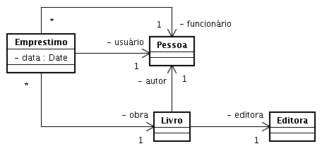

## Prática

 1. Crie a classe Livro. Esta classe deve possuir os atributos titulo, autor, ano e editora. 
 O atributo autor deve ser uma referência para uma instancia da classe Pessoa. 
 De forma análoga, o atributo editora deve ser uma referência para uma instância da classe Editora.
 
 1. Crie a classe Emprestimo. Uma instância desta classe representa o empréstimo de uma obra 
 (instância de Livro) realizada por um funcionário (instância da classe Pessoa) para um 
 determinado usuário (instância da classe Pessoa) da biblioteca em uma determinada data. 
 
 1. Crie um programa TestaEmprestimo. Este programa (classe) deverá, quando executado, 
 efetuar o empréstimo de um livro para um determinado usuário. Não se esqueça de registrar, 
 para a instância de Emprestimo a ser criada, o funcionário que efetuou o empréstimo. 
 Este programa também deverá imprimir os detalhes do empréstimo criado.

## Modelo




```java
package poo4;

import java.util.Date;

public class TestaEmprestimo {
    public static void main(String[] args) {
        
        // Cria instância de livro correspondente ao livro
        // a ser emprestado
        Editora editora = new Editora("EdX", "Rua X-54");
        Pessoa autor = new Pessoa("Jose Rei", 1900);
        Livro l = new Livro("MST",editora,autor,2004);
        
        // Cria instância que representa o empréstimo do livro
        Pessoa func = new Pessoa("Joao", 1930);
        Pessoa usr = new Pessoa("Ze Maria",1989);
        Emprestimo emp = new Emprestimo(l,func,usr, new Date());
        
        // Imprime conteúdo de empréstimo representado
        // pela instância criada acima.
        System.out.println(emp);
    }
}
```

```jaa
package poo4;

import java.util.Date;

public class Emprestimo {
    private Livro obra;
    private Pessoa funcionario;
    private Pessoa usuario;
    private Date data;
    
    public Emprestimo(Livro obra, Pessoa func, Pessoa usuario, Date data) {
        setObra(obra);
        setFuncionario(func);
        setUsuario(usuario);
        setData(data);
    }
    
    public String toString() {
        return "Livro emprestado: " + obra.toString() + "\n"
               + "Funcionario: " + funcionario.getNome() + "\n"
               + "Usuario: " + usuario.getNome() + "\n"
               + "Data: " + getData().toString();
    }

    public Pessoa getFuncionario() {
        return funcionario;
    }

    public void setFuncionario(Pessoa funcionario) {
        this.funcionario = funcionario;
    }

    public Livro getObra() {
        return obra;
    }

    public void setObra(Livro obra) {
        this.obra = obra;
    }

    public Pessoa getUsuario() {
        return usuario;
    }

    public void setUsuario(Pessoa usuario) {
        this.usuario = usuario;
    }

    public Date getData() {
        return data;
    }

    public void setData(Date data) {
        this.data = data;
    }
}
```

```
package poo4;

public class Livro {
    private String titulo;
    private int ano;
    private Editora editora;
    private Pessoa autor;
    
    public Livro(String titulo, Editora editora, Pessoa autor, int ano) {
        setTitulo(titulo);
        setAno(ano);
        setEditora(editora);
        setAutor(autor);
    }

    public int getAno() {
        return ano;
    }

    public void setAno(int ano) {
        this.ano = ano;
    }

    public Pessoa getAutor() {
        return autor;
    }

    public void setAutor(Pessoa autor) {
        this.autor = autor;
    }

    public Editora getEditora() {
        return editora;
    }

    public void setEditora(Editora editora) {
        this.editora = editora;
    }

    public String getTitulo() {
        return titulo;
    }

    public void setTitulo(String titulo) {
        this.titulo = titulo;
    }
    
    public String toString() {
        return getTitulo() + "\n" + getAutor().toString() + "\n"
               + getEditora().getNome() + ", " + getAno() + "\n"
               + getEditora().getLocal();
    }
}
```

```java
package poo4;

public class Pessoa {
    private String nome;
    private int anoNascimento;
    
    public Pessoa(String nome, int anoNascimento) {
        setNome(nome);
        setAnoNascimento(anoNascimento);
    }
    
    public int getAnoNascimento() {
        return anoNascimento;
    }

    public void setAnoNascimento(int anoNascimento) {
        this.anoNascimento = anoNascimento;
    }

    public String getNome() {
        return nome;
    }

    public void setNome(String nome) {
        this.nome = nome;
    }

    public String toString() {
        return getNome() + " (nascimento: " + getAnoNascimento() + ")";
    }
}
```

```java
package poo4;

public class Editora {
    private String nome;
    private String local;

    public Editora(String nome, String local) {
        setNome(nome);
        setLocal(local);
    }

    public String getLocal() {
        return local;
    }

    public void setLocal(String local) {
        this.local = local;
    }

    public String getNome() {
        return nome;
    }

    public void setNome(String nome) {
        this.nome = nome;
    }

    public String toString() {
        return getNome() + "\n" + getLocal();
    }
}
```

