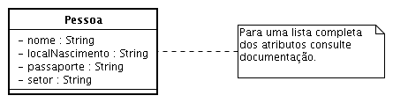
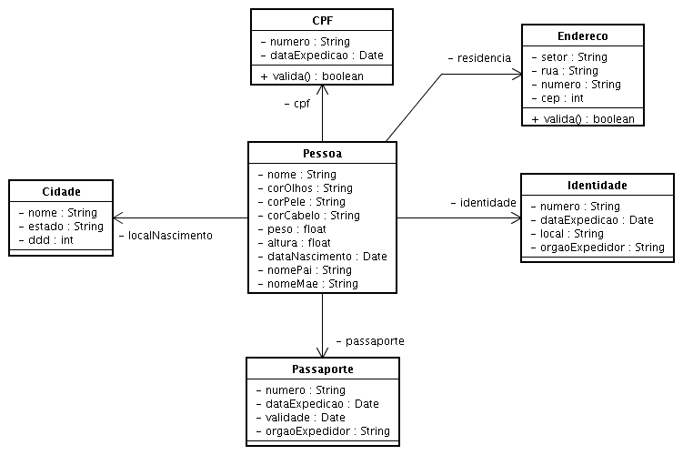

## Prátia

1. Crie a classe Pessoa. Esta classe deverá possuir atributos que permitam representar informações correspondentes a um ser humano. Alguns dos atributos incluem cor dos olhos,cor da pele, peso, altura, cor dos cabelos, data de nascimento, nome do pai, nome da mãe,nome e local de nascimento da pessoa.

1. Para um dado ser humano, representado por uma instância da classe Pessoa, tambémestamos interessados em informações como a identidade, passaporte (caso a pessoa emquestão possua) e endereço de residência. O endereço deverá incluir pelo menos aspropriedades rua, número e setor.

1. Métodos get/set devem ser disponibilizados para que os atributos ou propriedades, queirão armazenar as informações de interesse, possam ser alterados e/ou consultados. Todasas propriedades devem ser privadas, ou seja, declaradas como private. Por outro lado, osmétodos get/set devem ser públicos (public). Siga a lei do menor privilégio quando nãotiver um bom motivo para declarar um membro de dados público.

1. Crie a classe TestaPessoa. Esta classe, quando executada, deverá criar pelo menos duasinstâncias: uma correpondente à sua pessoa propriamente dita e outra a um ente que lhe éde valor.

1. Após criadas, o estado de cada uma destas instâncias deverá ser exibido na saída padrão.

## Solução

Uma solução imediata para esta prática é modelada abaixo. Nesta proposta, todos os atributos fazem parte da classe Pessoa (única classe do modelo). Por simplicidade, observe que apenas alguns atributos estão registrados, conforme a nota ressalta.



A solução acima pode ser melhorada. Todas as informações pertinentes a uma pessoa foram tratadas como atributos da classe Pessoa. Nem sempre esta abordagem é adequada. A classe perde em coesão. Por exemplo, uma das informações é o local de residência (endereço) do ser humano em questão.

Este endereço pode incluir setor, rua, número e outros detalhes. Quando uma instância de Pessoa for criada, todas estas informações terão que ser fornecidas à instância criada através de métodos como setRua(String rua) e setSetor(String setor), por exemplo. Um inconveniente destas mensagens é que elas não dizem respeito diretamente a uma pessoa, mas ao endereço de uma pessoa. Adicionalmente, é bem provável que endereço seja um recurso utilizado em outro
contexto, por exemplo, endereço de correspondência, e outros.

Caso seja interesse registrar o CEP, o que é bem provável, também teríamos que escrever código para validar o CEP fornecido para o setor, rua, número e provavelmente outros detalhes de um endereço. Esta funcionalidade de validação não é adequadamente atribuída uma instância de Pessoa, que representa um ser humano. Não é tarefa intrínseca de um ser humano, representado pela classe Pessoa, verificar a consistência de um endereço. Uma alternativa melhor seria transferir atributos pertinentes ao local de residência para uma nova classe: Endereco. A funcionalidade para verificar um endereço também seria transferida para esta nova classe, distribuindo as tarefas a serem realizadas de forma consistente.

O que foi comentado acima também vale para os atributos localNascimento, passaporte, CPF e identidade. A abordagem sugerida resulta no modelo abaixo.



No modelo acima vários atributos do modelo anterior foram substituídos por classes. Esta transformação deixa o modelo resultante mais simples e mais coeso. Um outro exemplo da distribuição inadequada do modelo anterior pode ser observado com a operação `valida()` da classe CPF. Sabe-se que todo CPF possui dois dígitos verificadores que são empregados para verificação. A operação correspondente, no modelo anterior, teria que estar disponível na classe Pessoa. Nesta nova versão esta responsabilidade foi transferida para a classe CPF. Esta mudança mantém a classe Pessoa, conforme já mencionado, mais coesa. O que foi retirado foi distribuído entre classes de propósitos bem específicos, contribuindo com a legibilidade do modelo.

Outras melhorias: (a) no nome do pai e o nome da mãe passam a ser tratados como instâncias da própria classe Pessoa; (b) admitindo que uma pessoa venha a morar em vários locais ao longo de anos, altere a solução para permitir o registro dos possíveis endereços de residência de uma pessoa ao longo do tempo de tal forma que, dada uma data para o método getEndereco, este método retornará o endereço da pessoa em questão na data fornecida.

```java
package poo5;

public class TestaPessoa {

    public static void main(String[] args) {
        Pessoa p = new Pessoa();
        p.setNome("X");

        System.out.println(p);
    }
}
```

```java
package poo5;

public class Endereco {

    /* Você deveria acrescentar outros atributos
     * para que esta classe seja considerada adequada
     */
    private String rua;
    private String setor;

    public Endereco(String rua, String setor) {
        super();
        this.rua = rua;
        this.setor = setor;
    }

    public String getRua() {
        return rua;
    }

    public void setRua(String rua) {
        this.rua = rua;
    }

    public String getSetor() {
        return setor;
    }

    public void setSetor(String setor) {
        this.setor = setor;
    }
}
```

```java
package poo5;

import java.util.Date;

public class Pessoa {

    // XXX Tipos mais adequados podem ser empregados
    private String corOlhos;
    private String corPele;
    private String corCabelo;
    private float peso;
    private float altura;
    private Date dataNascimento;
    private String localNascimento;
    private String nome;
    private String cpf;
    private String idt;
    private String passaporte;
    private String nomeMae;
    private String nomePai;
    private Endereco endereco;

    public float getAltura() {
        return altura;
    }

    public void setAltura(float altura) {
        this.altura = altura;
    }

    public String getCorCabelo() {
        return corCabelo;
    }

    public void setCorCabelo(String corCabelo) {
        this.corCabelo = corCabelo;
    }

    public String getCorOlhos() {
        return corOlhos;
    }

    public void setCorOlhos(String corOlhos) {
        this.corOlhos = corOlhos;
    }

    public String getCorPele() {
        return corPele;
    }

    public void setCorPele(String corPele) {
        this.corPele = corPele;
    }

    public String getCpf() {
        return cpf;
    }

    public void setCpf(String cpf) {
        this.cpf = cpf;
    }

    public Date getDataNascimento() {
        return dataNascimento;
    }

    public void setDataNascimento(Date dataNascimento) {
        this.dataNascimento = dataNascimento;
    }

    public String getIdt() {
        return idt;
    }

    public void setIdt(String idt) {
        this.idt = idt;
    }

    public String getLocalNascimento() {
        return localNascimento;
    }

    public void setLocalNascimento(String localNascimento) {
        this.localNascimento = localNascimento;
    }

    // Métodos get/set omitidos, por simplicidade, para
    // nome, nomeMae, nomePai, passaporte, peso, endereco

    // XXX Acrescentar demais atributos
    public String toString() {
        return "Nome: " + ((getNome() == null) ? "NF" : getNome())
               + "\nPai: " + ((getNomePai() == null) ? "NF" : getNomePai())
               + "\nMae: " + ((getNomeMae() == null) ? "NF" : getNomeMae());
    }
}
```
