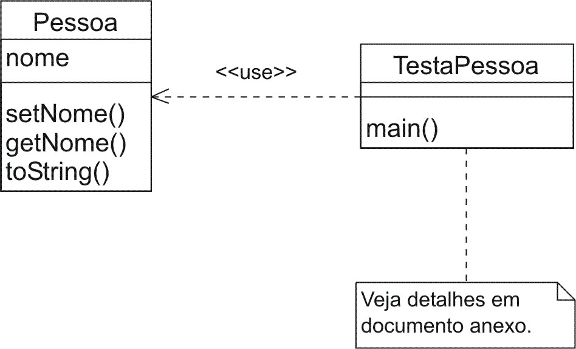

## Prátia

1.  Crie a classe Pessoa com apenas um atributo, nome, e os métodos getNome, setNome toString. O método getNome deverá retornar o nome da pessoa cuja instância que recebe mensagem correspondente representa. O método setNome atualizar o nome da pessoa emquestão. método toString deve retornar uma seqüência de caracteres que informa o estadoda nstância que recebe uma mensagem correspondente a este método.

1.  Crie a classe TestaPessoa. Esta classe deverá executar as seguintes atividades, na ordem em que são fornecidas:

    1. Criar duas instâncias: uma correspondente à pessoa “João da Silva” e utracorrespondente à “Maria de Jesus”.

    1. Após ter criado as duas instâncias, exiba os estados destas conforme o retorno oenvio da mensagem toString para cada uma delas.

    1. Envie a mensagem setNome para a instância correspondente à “Maria de Jesus” com argumento fornecido pelo retorno da mensagem getNome enviada à instânciacorrespondente à essoa “João da Silva”.

    1. Novamente imprima os estados de ambas as instâncias, conforme realizado no item 22 cima.

## Resposta



```java
package poo6;

public class Pessoa {
    private String nome;

    public Pessoa(String nome) {
        setNome(nome);
    }

    public String getNome() {
        return nome;
    }

    public void setNome(String nome) {
        this.nome = nome;
    }

    public String toString() {
        return getNome();
    }
}
```

```java
package poo6;

public class TestaPessoa {

    public static void main(String[] args) {
        Pessoa h = new Pessoa("Joao da Silva");
        Pessoa m = new Pessoa("Maria de Jesus");

        System.out.println(h);
        System.out.println(m);

        m.setNome(h.getNome());

        System.out.println(h);
        System.out.println(m);
    }
}
```
