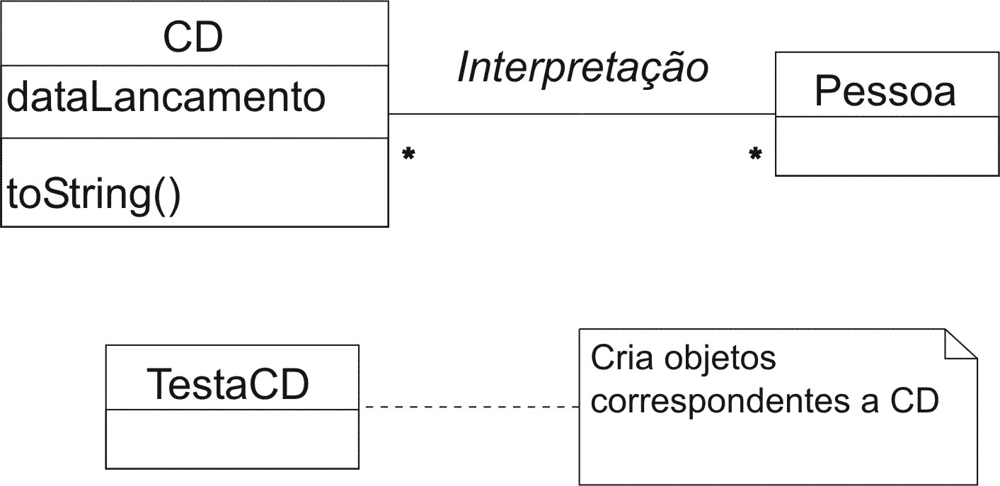
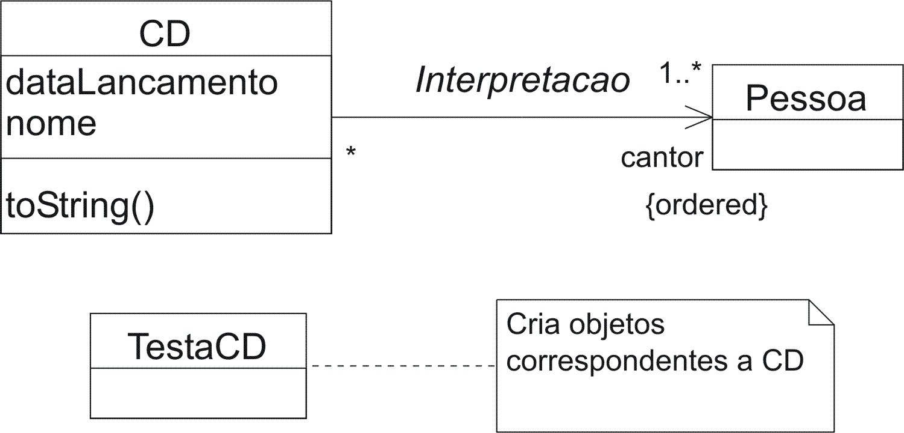

## Prática

1. Crie a classe CD com atributos correspondentes às informações: data de lançamento, nome, cantor ou cantores envolvidos. O cantor associado a um dado CD deve ser uma referência para uma instância da classe Pessoa.

1. Crie a classe TestaCD. A execução desta classe deverá produzir pelo menos uma instância correspondente a um CD qualquer. Após criar a instância, exiba o estado do objeto criado da classe CD por meio da chamada System.out.println(cd).

## Solução

Conforme o modelo abaixo, para um CD teremos uma ou mais ligações para instâncias de Pessoa (intérpretes). O papel cantor poderia ter sido acrescido, enriquecendo o modelo, na associação entre estas duas classes. Também observe que não há empecilho para que uma mesma pessoa seja cantor associado a várias instâncias de CD.



O modelo abaixo refina aquele fornecido acima. O papel cantor foi especificado na associação Interpretação. A associação que era bidirecional agora é orientada, de CD para Pessoa. Ou seja, identificar o cantor ou os cantores de determinado CD é uma tarefa simples. Por outro lado, dado um cantor, instância da classe Pessoa, pode ser trabalhoso o processo de identificação das instâncias da classe CD correspondentes. A cardinalidade foi alterada com o propósito de assegurar que não existe instância de CD sem que para a qual não se identifique pelo menos uma instância de Pessoa que desempenha o papel de cantor.

Por último, observe a restrição {ordered} fornecida no lado Pessoa da associação. Esta restrição indica que para uma dada instância de CD, aquelas instâncias da classe Pessoa correspondentes (ligadas) estão ordenadas. Ou seja, conforme o modelo é possível obter o primeiro cantor, o segundo e assim por diante. Se esta restrição não estivesse presente seria possível identificar todo o conjunto de cantores correspondentes a um CD, mas não seria possível estabelecer nenhuma ordem entre eles.



```java
package poo7;

public class Pessoa {

    private String nome;

    public Pessoa(String nome) {
        setNome(nome);
    }

    public String getNome() {
        return nome;
    }

    public void setNome(String nome) {
        this.nome = nome;
    }

    public String toString() {
        return nome;
    }
}
```

```java
package poo7;

import java.util.Date;

public class TestaCD {

    public static void main(String[] args) {
        Pessoa zeze = new Pessoa("Zezé di Camargo");
        Pessoa luciano = new Pessoa("Luciano");

        CD zezeLuciano = new CD("Roça", new Date(), zeze);
        zezeLuciano.adicionaCantor(luciano);

        System.out.println(zezeLuciano);
    }
}
```

```java
package poo7;

import java.util.*;

public class CD {
    private String nome;
    private Date dataLancamento;
    private ArrayList cantores = new ArrayList();

    public CD(String nome, Date dl, Pessoa cantor) {
        setNome(nome);
        setDataLancamento(dl);
        adicionaCantor(cantor);
    }

    public void adicionaCantor(Pessoa p) {
        cantores.add(p);
    }

    public Pessoa removeCantor(int ordem) {
        return (Pessoa)(cantores.remove(ordem));
    }

    public String toString() {
        String saida = "CD: " + nome + "\nCantores:\n";
        for (int i = 0; i < cantores.size(); i++) {
            saida += cantores.get(i).toString() + "\n";
        }
        return saida;
    }

    public Date getDataLancamento() {
        return dataLancamento;
    }

    public void setDataLancamento(Date dataLancamento) {
        this.dataLancamento = dataLancamento;
    }

    public String getNome() {
        return nome;
    }

    public void setNome(String nome) {
        this.nome = nome;
    }
}
```
