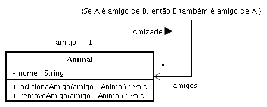

## Prátia

1. Crie a classe Animal com o atributo nome. Este atributo deverá reter o valor do nome de um “tipo” de animal. Cachorro, gato e elefante são possíveis valores para tipo de animal. (Perdoem-me os estudiosos da área.)

1. A classe Animal deverá possuir uma associação para ela própria. Esta associação deverá estabelecer ligações entre instâncias desta classe de tal forma que para uma dada instância de Animal seja possível identificar todos as instâncias de Animal que representam amigos da primeira instância. Ou seja, dado um animal, poderemos recuperar todos os animais amigos deste.

1. Acrescente os métodos adicionaAmigo e removeAmigo. Estes métodos deverão ser responsáveis, respectivamente, pela adição e remoção de um amigo para o animal em questão.

1. Crie a classe TestaAnimal. A execução desta classe deverá fazer com que várias instâncias da classe Animal sejam criadas. Naturalmente, cada uma delas corresponente a um tipo de animal.

1. Para as instâncias da classe Animal criadas no item 2, estabeleça relações de amizades entre elas, caso existam. Por exemplo, porco e galinha são animais amigos assim como vaca e cavalo. Ou seja, para um objeto da classe Animal que representa porco teríamos que enviar a mensagem adicionaAmigo. O argumento fornecido para tal chamada seria a instância de Animal que representa o animal galinha.

1. Após definidos os laços de amizada entre os animais, imprima, para cada instância de Animal criada, o nome do animal em questão seguido do nome do animal amigo, caso este exista. Se não existir, onde seria fornecido o nome do animal amigo escreva uma mensagem que indique ao usuário deste programa que tal animal não possui amigo.

## Solução

No modelo abaixo há uma associação de Animal para Animal rotulada por Amizade. A cardinalidade indica que um dado animal pode possuir vários amigos. A associação encontra-se orientada de amigo para amigos. Isto significa que, dado um animal, encontramos os amigos deste. Se entendermos que amizade é uma associação reflexiva (observe a restrição), ou seja, não é possível A ser amigo de B sem que B seja amigo de A, quando adicionarmos ou removermos um amigo de um dado animal, teremos que realizar operações complementares para que a restrição seja mantida.



```java
package poo8;

public class TestaAnimal {

    public static void main(String[] args) {
        Animal gato = new Animal("gato");
        Animal vaca = new Animal("vaca");
        Animal pato = new Animal("pato");
        Animal sapo = new Animal("sapo");
        Animal rato = new Animal("rato");
        Animal galo = new Animal("galo");

        // Gato não possui amigos neste ponto.
        System.out.println(gato);

        // Adiciona amigos para gato
        gato.adicionaAmigo(vaca);
        gato.adicionaAmigo(pato);
        gato.adicionaAmigo(sapo);
        gato.adicionaAmigo(rato);
        gato.adicionaAmigo(galo);

        // Gato político. Vejam as amizades!
        System.out.println("Amigos de gato: " + gato.amigosAnimal());

        // Observe o efeito em rato
        System.out.println("Amigos de rato: " + rato.amigosAnimal());

        // Removendo amizade de rato por gato
        rato.removeAmigo(gato);

        // Exibindo gato e rato (não são mais amigos)
        System.out.println("Amigos de gato: " + gato.amigosAnimal());
        System.out.println("Amgos de rato: " + rato.amigosAnimal());
    }
}
```

```java
package poo8;

import java.util.*;

public class Animal {

    private String nome;

    private Map amigos;

    public Animal(String nome) {
        setNome(nome);
        amigos = new HashMap();
    }

    public String getNome() {
        return nome;
    }

    public void setNome(String nome) {
        this.nome = nome;
    }

    public void adicionaAmigo(Animal amigo) {
        if (!amigos.containsKey(amigo.getNome())) {
            amigos.put(amigo.getNome(), amigo);
            amigo.adicionaAmigo(this);
        }
    }

    public void removeAmigo(Animal amigo) {
        if (amigos.containsKey(amigo.getNome())) {
            removeAmigo(amigo.getNome());
            amigo.removeAmigo(this);
        }
    }

    public void removeAmigo(String nomeAmigo) {
        amigos.remove(nomeAmigo);
    }

    public String toString() {
        return getNome();
    }

    public String amigosAnimal() {
        return amigos.toString();
    }
}
```
