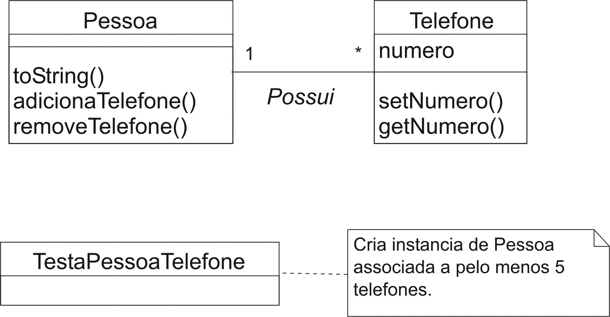

## Prática

1. Crie a classe Telefone com o atributo numero. Este atributo deverá reter o número do telefone em questão. Esta classe também deverá possuir os métodos get e set, para que este atributo possa ter o seu valor recuperado ou atualizado.

1. Crie a classe Pessoa. Cada instância dessa classe representa um ser humano que, sabemos, pode possuir vários telefones.

1. Crie a classe TestaPessoaTelefone com o propósito de testar as classes identificadas acima.

1. A classe TestaPessoaTelefone deverá criar uma instância de Pessoa e pelo menos 5 instâncias da classe Telefone. Todas as instâncias de Telefone criadas deverão ser ligadas à instância de Pessoa criada com o propósito de indicar que a pessoa em questão possui todos estes telefones.

1. Após as instâncias terem sido criadas, conforme item anterior, faça com que a instância de Pessoa receba a mensagem toString, cujo retorno deverá ser exibido na saída padrão. Este retorno deverá informar o nome da pessoa e todos os números dos telefones adquiridos por esta pessoa.

1. A classe Pessoa deve ser definida de tal forma que ao se tentar inserir o mesmo telefone mais de uma vez, apenas a primeira tenha efeito. O mesmo deve ocorrer ao se tentar remover um mesmo telefone mais de uma vez. Naturalmente, só uma remoção deverá ser possível, todas as posteriores não deverão ter nenhum efeito.

## Solução



```java
package poo9;

public class TestaPessoaTelefone {
    public static void main(String[] args) {

        Pessoa p = new Pessoa("Zeca dos Telefones");

        // Coloca sob controle o estoque do Zeca
        for (int i = 1; i <= 9; i++) {
            p.adicionaTelefone(new Telefone(Integer.toString(i)));
        }
        Telefone t10 = new Telefone("10");
        p.adicionaTelefone(t10);

        System.out.println(p);

        /* Zeca vende um dos telefones
         * Para remover, observe que foi empregada uma referência
         * em vez do número do telefone. Doutra forma o objeto
         * não seria removido, pois a classe Telefone não sobrepõe
         * o método equals. Ou seja, dois objetos só serão iguais
         * caso as referências empregadas indiquem o mesmo objeto.
         */
        p.removeTelefone(t10);

        System.out.println(p);
    }
}
```

```java
package poo9;

import java.util.*;

public class Pessoa {
    private String nome;
    private Set telefones = new HashSet();

    public Pessoa(String nome) {
        setNome(nome);
    }

    public String getNome() {
        return nome;
    }

    public void setNome(String nome) {
        this.nome = nome;
    }

    public void adicionaTelefone(Telefone t) {
        telefones.add(t);
    }

    public void removeTelefone(Telefone t) {
        telefones.remove(t);
    }

    public String toString() {
        return getNome() + " telefones: " + telefones.toString();
    }
}
```

```java
package poo9;

public class Telefone {
    private String numero;

    public Telefone(String numero) {
        setNumero(numero);
    }

    public String getNumero() {
        return numero;
    }

    // XXX Terá que validar o número recebido.
    public void setNumero(String numero) {
        this.numero = numero;
    }

    public String toString() {
        return getNumero();
    }
}
```
