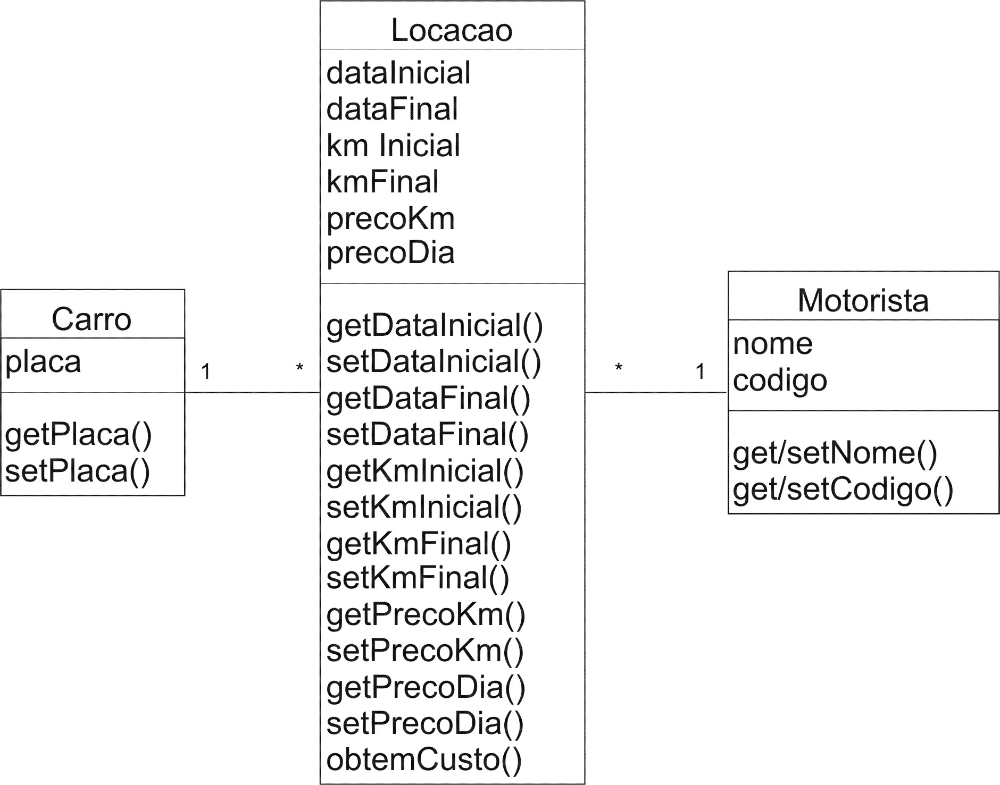

## Prática

1. Em uma empresa de locação de automóveis existem vários automóveis. Crie a classe Carro para que uma instância desta classe possa representar um automóvel. Cada automóvel, nesta empresa, é identificado apenas pelo número da placa. Crie uma propriedade na classe Carro para armazenar a placa do automóvel e os métodos get e set com o propósito de que seja possível obter o valor de uma placa de determinado automóvel. O método set deve ser declarado private, pois não é possível, neste exemplo, alterar a placa de um mesmo automóvel. Ou seja, se é necessário alterar a plca de um automóvel, então teremos que criar um outro automóvel (instância de Carro).

1. Toda locação de um automóvel é feita com a disponibilidade de um automóvel e um motorista. Nesta empresa, nenhum dos automóveis locados é dirigido pelos clientes, mas pelos motoristas da própria empresa. Cada motorista nesta empresa é identificado por um nome e um código que, portanto, serão atributos da classe Motorista. Esta classe deve implementar os métodos get e set para tais atributos. À semelhança de caso anterior, o que identifica unicamente um motorista é o código deste, ou seja, não deve ser possível alterar tal código.

1. Uma locação é realizada em determinada data. Seja dataIncial o atributo da classe Locacao que representa o dia de início da locação e dataFinal o dia em que a locação é encerrada.

1. Além das datas é relevante a quilometragem marcada no automóvel, no momento em que a locação ocorre. Faça uso do atributo kmInicial para registrar este valor. A quilometragem deve ser atributo de locação. Quando a locação termina, a quilometragem marcada também é registrada. Seja kmFinal o atributo que irá armazenar este valor.

1. Crie métodos get e set para todas as propriedades da classe Locacao.

1. Para que uma nota fiscal possa ser emitida é necessário identificar o custo da locação, que é calculado de forma simples envolvendo a quilometragem percorrida e o período em que ocorreu este deslocamento, conforme a expressão abaixo:
   ((kmFinal – kmInicial) _ precoKm) + ((dataFinal – dataInicial) _ precoDia)

1. Crie o método obtemCusto que retorna o valor da expressão identificada no item anterior. Observe que a expressão envolve duas outras variáveis, precoKm e precoDia, cujos significados podem ser deduzidos facilmente dos identificadores destas variáveis. Crie tais propriedades na classe Locacao e os métodos get e set para estas variáveis.

1. Observe que as variáveis precoKm e precoDia são variáveis de instância. Ou seja, casa instância de Locacao pode ter valores diferentes das demais. Nenhum problema com isto, afinal, de acordo com uma prática muito comum mas quase sempre camuflada, o preço é definido para cada cliente. Observe que isto não impede a existência de uma tabela a partir da qual um valor de referência pode ser consultado.

1. Crie a classe TestaLocacao que cria pelo menos duas locações com datas e quilometragens fictícias. Além, naturalmente, dos automóveis e motoristas correspondentes. Após a criação, simule a devolução dos automóveis. Ou seja, estabeleça datas e quilometragens fictícias para as propriedades correspondentes à devolução dos automóveis locados. Posteriormente, gere um relatório indicando, para cada locação, o motorista, as datas de início e fim bem como as quilometragens de início e fim seguidas do custo da locação.

## Solução



```java
package poo10;

public class Carro {
    private String placa;

    public Carro(String placa) {
        setPlaca(placa);
    }

    public String getPlaca() {
        return placa;
    }

    public void setPlaca(String placa) {
        this.placa = placa;
    }

    public String toString() {
        return getPlaca();
    }
}
```

```java
Classe poo10.Motorista (Motorista.java)
package poo10;

public class Motorista {
    private String nome;
    private String codigo;

    public Motorista(String nome, String codigo) {
        setNome(nome);
        setCodigo(codigo);
    }

    public String getCodigo() {
        return codigo;
    }

    public void setCodigo(String codigo) {
        this.codigo = codigo;
    }

    public String getNome() {
        return nome;
    }

    public void setNome(String nome) {
        this.nome = nome;
    }

    public String toString() {
        return getNome() + " (" + getCodigo() + ")";
    }
}
```

```java
package poo10;

public class TestaLocacao {

    public static void main(String[] args) {
        Motorista m1 = new Motorista("Ze", "1");
        Carro c1 = new Carro("ZAZ 9999");

        /* Simula locação de 01/04/2004 até 05/04/2004
         * com quilometragem inicial 150 e final 490
         * Preco por dia: R$32,00
         * Preco por km: R$1,20
         */
        Locacao l1 = new Locacao();
        Calendar c = Calendar.getInstance();
        c.set(2004,4,1);
        l1.setDataInicial(c.getTime());
        c.set(2004,4,5); // Quatro dias depois...
        l1.setDataFinal(c.getTime());
        l1.setKmInicial(150);
        l1.setKmFinal(490);
        l1.setPrecoDia(32);
        l1.setPrecoKm(1.2F);
        l1.setCarro(c1);
        l1.setMotorista(m1);

        // Emite detalhes de locação (inclusive custo)
        System.out.println(l1);
    }
}
```

```java
package poo10;

import java.util.*;

public class Locacao {
    private Date dataInicial;
    private Date dataFinal;
    private int kmInicial;
    private int kmFinal;
    private float precoKm;
    private float precoDia;
    private Motorista motorista;
    private Carro carro;

    public double obtemCusto() {
        // Obtém números de dias transcorridos
        long nDias = dataFinal.getTime() - dataInicial.getTime();
        nDias = nDias / (1000 * 60 * 60 * 24);

        return (kmFinal - kmInicial) * precoKm + nDias * precoDia;
    }


    // Seguem aqui os métodos set/get omitidos apenas por questão de espaço
    // ...

    public String toString() {
        String saida = "Motorista: ";
        saida += getMotorista().toString() + "\n";
        saida += "Carro: " + getCarro().toString() + "\n";
        saida += "Quilometragem inicial: " + getKmInicial();
        saida += " final: " + getKmFinal() + "\n";
        saida += "Data locacao: " + getDataInicial().toString();
        saida += " entrega: " + getDataFinal().toString() + "\n";
        saida += "R$/km: " + getPrecoKm() + " R$/dia: " + getPrecoDia();
        saida += "\nCusto da locacao: " + obtemCusto();

        return saida;
    }
}
```
