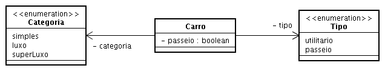
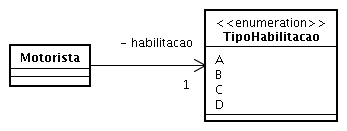
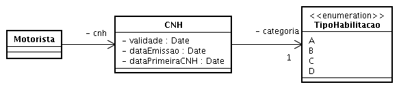
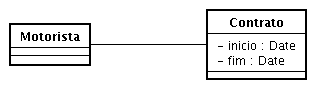
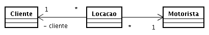
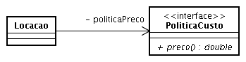

## Prática

Na prática [anterior](./12.md) foram criadas as classes Carro, Locaao e Motorista.
Estas classes precisam ser modificadas para contemplar os seguintes e novos
requisitos:

1. Um carro pode ser do tipo utilitário e passeio. Um carro de passeio ainda pode ser caracterizado como simples, luxo e super-luxo.

1. A habilitação de um motorista pode ser do tipo A, B, C ou D. Apenas a habilitação C ou D pode ser empregada para dirigir um carro utilitário. A habilitação A não é suficiente para dirigir um carro de passeio, ao contrário de todas as demais.

1. Alguns clientes preferem motoristas que possuem muita experiência, mais de cinco anos na empresa. A requisição mais freqüente, contudo, pede que o último motorista que os atendeu os sirva novamente.

1. O custo de uma locação é acrescido de 10% do preço base (obtemCusto) se o carro é de luxo. Se for super-luxo, então a alíquota é de 20%. Qualquer carro utilitário onera o custo da locação em 15% do preço base (obtemCusto).

1. Motorista com mais de cinco anos na empresa onera o custo da locação em 5% do preço base (obtemCusto). Ou seja, um motorista experiente para um carro utilitário terá como custo total o custo base (obtemCusto) acrescido de 20% do custo base (obtemCusto).

1. Segunda locação ou posterior para um cliente, em uma mesma quinzena, tem o custo de locação (preço base) reduzido em 10%.

## Solução

A solução para a prática anterior, sem considerar os itens presentes neste exercício, fazia uso do modelo abaixo. Neste modelo, cada locação está associada, necessariamente, a um motorista e a um automóvel, conforme inlustrado. (Detalhes das classes foram omitidos por simplicidade.) A solução do presente exercício será apresentada item por item.


### Um carro pode ser do tipo utilitário e passeio. Um carro de passeio ainda pode ser caracterizado como simples, luxo e super-luxo.

Isto pode ser facilmente resolvido com o emprego de enumerações. Observe que as classes Categoria e Tipo, fornecidas abaixo, estão estereotipadas como enumeration, para indicar que são classes que representam enumerações.



O classe Categoria pode ser convertida para código em Java como abaixo.

```java
public enum Categoria {
	simples, luxo, superLuxo
}
```

De forma análoga segue a classe Tipo.

```java
public enum Tipo {
	utilitario, passeio
}
```

A classe Carro pode então ser alterada para acomodar a mudança apresentada no modelo. Apenas parte envolvida com a mudança é apresentada por simplicidade.

```java
public class Carro {
    private String placa;
    private Categoria categoria;
    private Tipo tipo;

    public Categoria getCategoria() {
		return categoria;
	}

	public void setCategoria(Categoria categoria) {
		this.categoria = categoria;
	}

	public Tipo getTipo() {
		return tipo;
	}

	public void setTipo(Tipo tipo) {
		this.tipo = tipo;
	}
	...
}
```

As alterações acima atendem o item 1 do exercício. Os restante deste texto considera os demais itens, na ordem em que aparecem.

### A habilitação de um motorista pode ser do tipo A, B, C ou D. Apenas a habilitação C ou D pode ser empregada para dirigir um carro utilitário. A habilitação A não é suficiente para dirigir um carro de passeio, ao contrário de todas as demais.

A habilitação de um motorista pode ser registrada de forma análoga ao que foi realizado anteriormente para Categoria e Tipo. Este tipo de habilitação, contudo, deverá ser de responsabilidade de uma classe. Considere inicialmente o modelo abaixo.



Não há nada inerentemente ruim com o modelo acima, mas ele pode ser melhorado. Se o entendimento correto é que o tipo de habilitação é informação contida em uma carteira de habilitação ou CNH, que também possui outras informações como período de validade, restrições e outras informações, então o modelo resultante seria aquele abaixo, ao contrário da versão “simples” exibida acima.



Uma implementação do modelo acima é similar ao que foi realizado para o item 1. Este modelo, contudo, não resolve todo o item 2. É preciso assegurar, conforme a descrição do item, que nenhum motorista faça parte de uma alocação cujo automóvel seja incompatível com a categoria de habilitação do motorista. Esta verificação pode ser feita com um método como abaixo. A responsabilidade pela implementação deste método é da classe Locacao. Afinal, trata-se de uma regra necessária para a construção de uma locação válida.

```java
public boolean compativel(Motorista m, Carro carro) {
    TipoHabilitacao hab = m.getCategoria();

    // C ou D pode dirigir qualquer carro
    boolean retorno = hab.equals(TipoHabilitacao.C)
            || hab.equals(TipoHabilitacao.D);

    // Se não for C ou D, então apenas carro de passeio
    // poderá ser dirigido por carteira B
    if (!retorno) {
        retorno = hab.equals(TipoHabilitacao.B)
		&& carro.getTipo().equals(Tipo.passeio);
    }

    return retorno;
}
```

Observe como o código acima foi escrito, evitando o emprego de sentenças return. Convém ressaltar que a complexidade ciclomática de um código aumenta de forma significativa a cada return empregado por um método. Em tempo, complexidade ciclomática é uma métrica geralmente empregada para fornecer uma indicação de quão complexo é um código. Quanto mais complexo, por exemplo, mais difícil é a tarefa de testá-lo. Detalhes podem ser obtidos em http://en.wikipedia.org/ para o termo cyclomatic complexity.

### Alguns clientes preferem motoristas que possuem muita experiência, mais de cinco anos na empresa. A requisição mais freqüente, contudo, pede que o último motorista que os atendeu os sirva novamente.

Para identificar se um motorista possui mais de cinco anos de trabalho na empresa pode-se desde definir o atributo dataIngresso para Motorista ou, alternativamente, seguir o modelo abaixo, onde informações trabalhistas são armazenadas em contratos de trabalho.



Para permitir que seja identificado o motorista que atendeu determinado cliente, em uma locação, é necessário registrar informações sobre clientes. Para cada locação deveremos ter a indicação do motorista (informação disponível mesmo nos modelos anteriores) e a indicação do cliente. A extensão correspondente é modelada conforme abaixo.



A data da locação, necessária para identificar a última locação de determinado cliente e, em consequência, permitir a localização do motorista que prestou o serviço está disponível na classe Locacao. Este atributo foi omitido por simplicidade. Modelos são assim, não precisam ser completos, exaustivos. Modelos precisam apenas ressaltar uma perspectiva de interesse.

### Estes itens estão diretamente associados à regra de cálculo do custo total de uma locação. Esta regra pode ser implementada, como já feito anteriormente, através do emprego de um método. Neste caso, o método custoTotal é acrescido à classe Locacao e implementada conforme abaixo.

```java
public double custoTotal() {
    // Valores adicionais são calculados sobre preço base (pb)
    double pb = obtemCusto();

    double ca = 0.0; // Custo adicional
    ca = (carro.getCategoria().equals(Categoria.luxo)) ? 0.15 * pb : 0.0;
    ca = (carro.getCategoria().equals(Categoria.superLuxo)) ? 0.2 * pb : 0.0;
    ca = (carro.getTipo().equals(Tipo.utilitario)) ? 0.15 * pb : 0.0;

    // Antiguidade do motorista pode onerar em 5%.
    Calendar inicio = Calendar.getInstance();
    inicio.add(Calendar.YEAR, -5);
    ca = inicio.after(motorista.getContrato().getInicio()) ? 0.05 * pb : ca;
    return pb + ca;
}
```

Embora esta implementação seja suficiente para resolver o exercício, talvez o modelo abaixo seja mais indicado, pois as regras de cálculo irão variar, tornando a classe Locacao muito instável.


