## Orientação a Objetos: Fundamentos

Por mais simples que seja um problema a ser implementado, será preciso
empregar alguma forma de projeto (_software design_). A perspectiva orientada a objetos, uma das mais empregadas tanto pela indústria quanto pela academia para a atividade de projeto de software, é comentada abaixo.

> Pensar em código da perspectiva orientada a objetos é pensar na interação entre objetos. O que pressupõe a identificação dos objetos e a distribuição de responsabilidades entre eles, o que torna a interação obrigatória. Dito de outra forma, código orientado a objeto em execução é um conjunto de objetos que cooperam entre si.

Antes de prosseguir convém ressaltar que orientação a objetos é uma ferramenta e, portanto, é preciso saber quando usá-la e como usá-la.
O quando e o como ainda devem ser precedidos do conhecimento e ambientação
com os elementos que fazem parte da orientação a objetos, ou conceitos.

## Modelagem

Orientação a objetos é uma forma de pensar, uma perspectiva de observação de um alvo concreto (matéria) ou abstrato (ideia). Aplicá-la é contemplar um determinado cenário desta perspectiva.

Esta perspectiva seria de pouca utilidade se não fosse possível registrá-la. Sem registro a história é curta, não há o que compartilhar com membros de uma equipe, e torna praticamente impossível qualquer tipo de averiguação ou análise. Felizmente há várias propostas para registro
da "visão" orientada a objetos.

A _Unified Modeling Language_, ou [UML](http://uml.org) por simplicidade, tem mostrado força no meio industrial e se tornou um padrão de fato para o registro de artefatos orientados a objetos. A UML possui construções para especificar, visualizar e documentar artefatos de software da perspectiva orientada a objetos. Esta é a linguagem empregada neste texto, apresentada juntamente com termos típicos do mundo orientado a objetos. Um resumo da UML pode ser obtido [aqui](http://umich.edu/~eecs381/handouts/UMLNotationSummary.pdf).

## Conceitos

_Objeto_ é uma abstração que pode representar tanto uma entidade física quanto um conceito, que pode existir concretamente ou apenas na forma de ideia. A entidade objeto possui uma identidade única, além de um estado (dados) e de comportamento (métodos). A reunião de dados e métodos
forma um objeto.

Por exemplo, em um sistema que controla o
patrimônio da sua empresa provavelmente há um objeto correspondente ao computador que você faz uso. O estado deste objeto indica a frequência da CPU, a quantidade de memória disponível e outros atributos. Este objeto também poderá reagir a mensagens (envio de métodos). Um método típico para este objeto é _getCPU_, que retorna o nome do fabricante da CPU.

A identidade permite distinguir um objeto dentre os demais, mesmo que estes possuem um estado semelhante.

O estado de um objeto é descrito pelos valores do correspondente conjunto de
_atributos_, ou propriedades que são encapsuladas pelo objeto. O comportamento é definido através de _métodos_. Um objeto interage com outro objeto através do envio de uma
_mensagem_ ao destinatário, o que é
realizado pela chamada de um método. Um objeto pode, por exemplo, requisitar o
valor de um atributo de um determinado objeto através do envio de uma mensagem
para este determinado objeto.

Os atributos de um objeto e os métodos através dos quais este objeto pode receber mensagens são descritos por uma _classe_. Classe é uma espécie de forma (ô) através da qual os objetos são criados. Em tempo, objeto é uma
_instância_ de uma classe.

Quando se define uma classe, também é definido tudo que um cliente precisa saber a respeito desta classe. Esta definição captura a visão externa da classe, ou o que será oferecido para clientes desta classe. Noutras palavras,
trata-se da interface que esta classe oferece para que o mundo externo entre em contatos com instâncias desta classe. Não confunda o conceito interface, como foi aqui empregado, com o mecanismo que linguagens de programação
oferecem para definir um contrato.

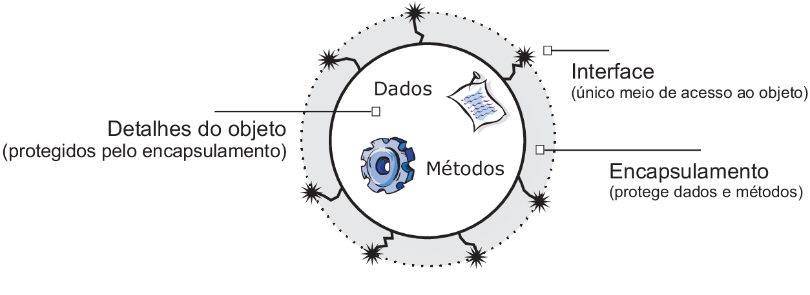

De uma classe podem ser criadas zero ou mais instâncias. Classes não reagem a
mensagens, pois não se pode enviar mensagens a uma classe. Quem recebe
mensagens são objetos. Uma classe define um conjunto de métodos, mas são os objetos, entidades "com vida", que podem receber mensagens através da interface definida na classe. Classe não possui estado, mas define o conjunto de atributos cujos valores formam o estado de um objeto.

### Interação entre objetos

Não é suficiente representar um conjunto de objetos para se derivar um
software correspondente. É preciso capturar a troca de mensagens entre objetos
ao longo do tempo. Objetos não se encontram isolados, mas interagem entre
si. Ter uma tarefa realizada em um modelo orientado a objetos é fazer com que
os objetos cooperem uns com os outros, conforme a responsabilidade necessitada
por um objeto e oferecida por outro.

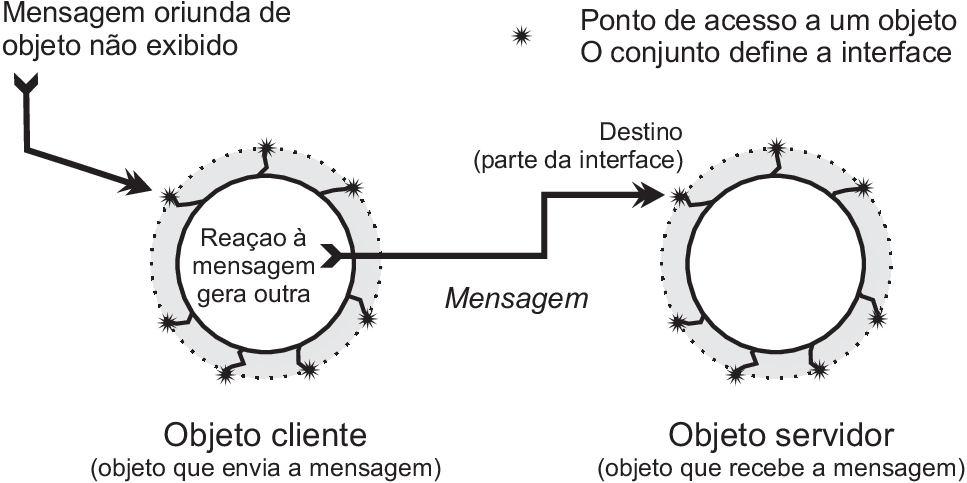

A cooperação se dá através de mensagens. Para que um objeto usufrua de
responsabilidade oferecida por
outro objeto é necessário que este receba uma mensagem do primeiro. Uma
mensagem só é possível caso exista um ponto de interação que faça parte da
interface do objeto. A interação de um objeto A para um objeto B está
restrita à interface do objeto B. Se estas condições são satisfeitas, então o
objeto que recebe a mensagem executa o método. Ao final da execução do método,
o controle é transferido de volta para o objeto que enviou a mensagem.

### Classe

Classe é a combinação de propriedades e comportamentos. O conjunto de
propriedades define todo um conjunto de valores possíveis que poderão ser
assumidos por objetos desta classe. Os comportamentos representam todas as
mensagens que poderão ser enviadas aos objetos desta classe. Uma classe,
contudo, é apenas um molde. São objetos criados a partir de classes que
possuirão um estado e reagir a mensagens. Criar um objeto, ou instância de uma
classe, é algo similar à criação de uma variável.

Uma variável de um tipo primitivo, contudo, possui um domínio de valores e um
conjunto de operações predefinidas pela linguagem. Por exemplo, em algumas
linguagens é possível realizar _x + y_ onde os operandos são sequências
de caracteres, enquanto _x \* y_ envolve um operador não permitido para o
tipo sequência de caracteres.

Uma classe, ao contrário de tipos predefinidos, inclui dados e métodos
considerados apropriados para a abstração em questão. Por exemplo, talvez não
exista nenhuma linguagem de programação que possua o tipo predefinido
_Pessoa_, mas uma linguagem de programação orientada a objetos permitirá
a criação da classe _Pessoa_. A existência desta classe torna possível a
criação de instâncias que representam seres humanos. Uma instância, ou objeto,
terá um estado correspondentes a um ser humano, por exemplo, "José da Silva"
nascido em 01/02/1967. A modelagem correspondente em que foram omitidos os
atributos e os métodos da classe _Pessoa_ é fornecida abaixo.

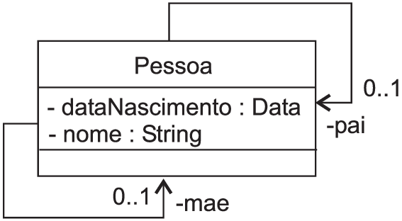

A figura \ref{fig-uml-pessoa} faz uso da modelagem de uma classe empregando
três compartimentos: (a) nome da classe, (b) atributos e (c) métodos. Apenas o
nome da classe, primeiro compartimento, foi fornecido nesta figura. Os outros
dois compartimentos estão vazios.

Conforme a figura \ref{fig-uml-pessoa-detalhes}, os compartimentos de
atributos e métodos podem ser omitidos. A opção entre um e outro depende do
interesse que se pretende fazer do modelo. Em alguns cenários pode ser
suficiente representar a classe _Pessoa_ sem o detalhamento dos atributos
e dos métodos, enquanto em outros pode ser imprescindível a descrição destes
elementos.

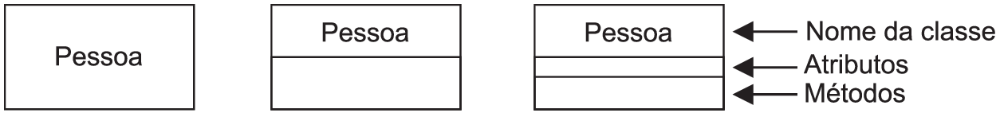

### Atributos de classe

O estado de um objeto é determinado pelos valores dos atributos da classe
correspondente. No exemplo da figura abaixo, a classe
_Pessoa_ é declarada com quatro atributos. São os valores destes quatros
atributos para uma dada instância que irão determinar o estado desta instância
em determinado instante.

Observe que nenhum método é fornecido na declaração desta classe. Três dos
atributos são privados, o que significa que são visíveis exclusivamente no
corpo da classe, enquanto _idade_ é declarado público, ou seja, é visível
em outras classes, que desconhecem a existência de _dia_, _mes_ e
_ano_.

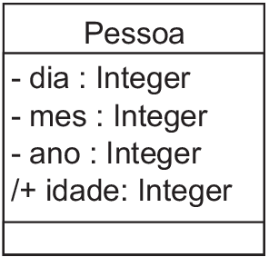

Os atributos são do tipo _Integer_, predefinido na UML. Representa um elemento de um conjunto infinito representado pelos inteiros, ou seja, -2, -1, 0 e 256 são elementos deste conjunto. Quando esta classe for implementada, naturalmente este tipo terá que ser mapeado para o tipo correspondente na linguagem de programação empregada. Por exemplo, em Java os dois bytes do tipo predefinido _short_ são suficientes. Se a linguagem é VB.NET, então pode ser empregado o tipo predefinido _short_, que representa um inteiro de dois bytes.

A classe na figura acima possui um atributo derivado. Um atributo derivado é aquele que pode ser obtido dos demais. A versão UML faz uso de uma barra / para identificar um atributo derivado.

Esta barra indica que o atributo _idade_ é derivado. Os demais atributos, _dia_, _mes_ e _ano_ identificam a data de nascimento da pessoa em questão e, portanto, o valor do atributo _idade_ pode ser obtido dos valores dos demais atributos.

### Métodos de classe

Uma classe é a união de atributos, que descrevem o domínio dos estados dos objetos criados a partir desta classe, e métodos, que descrevem o comportamento. Os métodos são descritos no terceiro compartimento de um classe em UML, conforme a ilustração na figura abaixo.

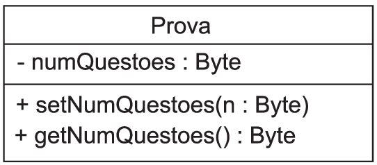

Para que este atributo privado possa ser manipulado, dois métodos foram fornecidos com o modificador de acesso público.

O método _getNumQuestoes_ é dito um método _get_. Retorna o valor do atributo em questão. A construção do nome deste tipo de método é formado pela concatenação de _get_ com o identificador do atributo. Todas as iniciais de nomes que formam o identificador do atributo são fornecidas em maiúsculas. Esta convenção é a mesma empregada pela especificação da UML.

A formação do nome do método _set_ é similar à formação para o nome do método _get_. Enquanto o primeiro não recebe um valor do tipo _Byte_, o segundo retorna um valor deste tipo.

### Associações entre classes

Uma associação é um relacionamento entre classes. Associação é um meio de comunicação entre objetos das classes envolvidas. O objetivo de uma associação é descrever a relação semântica existente entre instâncias destas classes. Uma associação é representada por uma linha sólida entre as classes envolvidas no relacionamento, conforme a figura abaixo.

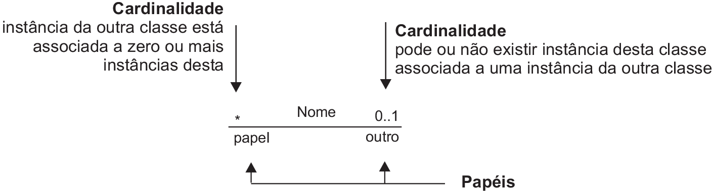

No mundo real, alunos matriculam-se em cursos. Esta relação é modelada conforme a associação exibida na figura \ref{fig-uml-association}. O nome _Matrícula_ ressalta o significado da associação, não é obrigatório. A cardinalidade indica que um aluno pode estar matriculado em um curso e não em mais do que um. Ou seja, pode ser que tenhamos um dado aluno, em dado instante de tempo, que não esteja matriculado em um curso. Por outro lado, dado um objeto da classe _Curso_, podem existir zero ou mais instâncias da classe _Aluno_ associados.

As instâncias de uma associação são denominadas de ligações. Ou seja, o modelo registra um possível cenário no qual, em determinado instante, um objeto da classe _Curso_ está ligado a vários objetos da classe _Aluno_. Nesta ligação, os objetos da classe _Alunos_ desempenham o papel _alunos_, enquanto o objeto da classe _Curso_ desempenha o papel _Curso_. (Não faça como neste exemplo, se o papel fornecido é óbvio, simplesmente não o forneça.)

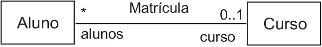

Para que uma associação seja utilizada por um objeto é necessário a existência de atributos que implementem a associação. Por exemplo, sabemos que um curso é formado por zero ou mais alunos, ou seja, dado um curso, desejamos saber quais os alunos correspondentes. Uma possibilidade de realização da associação é manter um atributo que seja uma coleção de alunos. No modelo UML, contudo, nem sempre uma associação é descrita juntamente com os atributos correspondentes.

Quando os atributos são fornecidos tem-se uma redundância. Alternativamente, alguém poderia descrever os atributos e não estabelecer uma associação entre as classes.

Neste caso, qual seria a forma mais indicada? A resposta depende do contexto. A associação deve ser fornecida quando for relevante para a legibilidade e a compreensão do modelo. É fácil perceber que a relação entre um aluno e um curso é informação útil para um sistema de controle acadêmico.

### Associações reflexivas

Em uma associação reflexiva os extremos da associação são uma mesma classe conforme a figura \ref{fig-uml-pessoa2}. Toda pessoa possui um pai e uma mãe (denominados de _papéis_). O modelo, contudo, contenta-se com pessoas para as quais os pais não estão estabelecidos. Ou para as quais apenas o pai ou a mãe é conhecido(a).

Uma instância da classe _Pessoa_ pode estar ligada a várias instâncias desta classe, pois há um extremo de uma associação cuja cardinalidade não é explicitamente fornecida. Neste caso, o padrão é zero ou mais. Em _UML 2.0 Infrastructure Specification_, seção 8.2.2, lê-se claramente: "a multiplicidade de um extremo de uma associação é omitido se é \_ (valor padrão na UML)".

Quando uma associação possui uma seta em uma das extremidades a orientação da seta indica a navegabilidade. Noutras palavras, de uma instância de pessoa é possível identificar o pai e a mãe da pessoa em questão, caso sejam estabelecidos. Por outro lado, dada uma pessoa, mesmo que esta possua vários filhos, não é possível identificar com facilidade a prole do indivíduo.

Se a associação não possui uma orientação, então esta é dita bidirecional. Se as associações discutidas fossem bidirecionais, então de um pai poderíamos recuperar os filhos correspondentes de forma imediata, o que não é o caso.

De acordo com o modelo, embora seja possível identificar os filhos de
determinada pessoa, esta informação é trabalhosa de ser obtida, pois
provavelmente, teremos que percorrer todas as instâncias de
_Pessoa_. Para cada instância, o pai e a mãe são obtidos diretamente
pelas associações.

### Agregação

Uma associação estabelece um relacionamento entre classes. Quando uma
instância de uma classe contém instâncias de outra classe a associação é
denominada de agregação. Ou seja, um objeto é parte lógica de outro objeto.

Em uma festa convencional vários convidados estão presentes. Imagine que há
festa desde que venha pelo menos um convidado. A classe _Festa_ está
associada à classe _Convidado_ por uma agregação, denotada por um
losango, conforme ilustra a figura abaixo.

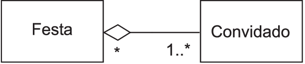

Outro exemplo segue na figura abaixo. Uma _União_ pode
dar origem a vários filhos, cada um uma instância de _Pessoa_. O
relacionamento denominado de _Prole_ captura esta semântica. O
_Casamento_, por outro lado, pode ser visto como uma agregação de duas
pessoas. Impossível mais romantismo, devidamente registrado no modelo.

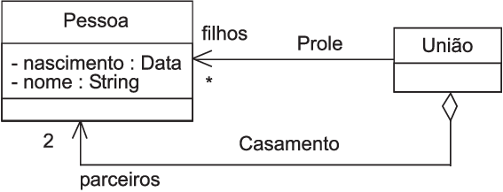

Neste modelo as associações não são bidirecionais. Ou seja, dado um objeto da
classe _Pessoa_, não é fácil identificarmos se o ser humano
correspondente encontra-se casado ou o parentesco deste, embora tais
informações possam ser obtidas.

### Composição

Composição é uma associação do tipo todo/parte, à semelhança de uma agregação. Em uma composição, contudo, quando o todo é criado, as partes correspondentes são criadas, quando o todo é destruído, as partes deste todo são destruídas. Por exemplo, na figura abaixo, observa-se que _Religião_ é uma composição de _Devoto_, o que é denotado pelo losango hachurado.

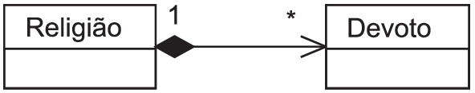

Neste exemplo, há um relacionamento entre instâncias de _Devoto_ e de _Religião_. Em particular, dado o fato de se tratar de uma composição, o modelo ressalta que não existe instância de _Devoto_ sem uma correspondente instância de _Religião_. Uma instância de _Religião_ pode estar ligada a vários devotos e, em particular, talvez nenhum devoto. Conforme o modelo, se a religião de alguns devotos desaparecer, então estes devotos desaparecem junto.

Observe que a opção entre agregação e composição pode não oferecer, em alguns
casos, informação semântica de valor e, portanto, simplesmente faça opção pelo
relacionamento que considerar mais natural. Por outro lado, há casos onde não
deve pairar dúvidas. _Reunião_ é uma agregação de _Pessoa_ e não
faria sentido ser uma composição. Por outro lado, _Roupa_ pode ser
modelada como uma composição de _Botão_, _Tecido_ e outras partes
conforme ilustra a figura abaixo.

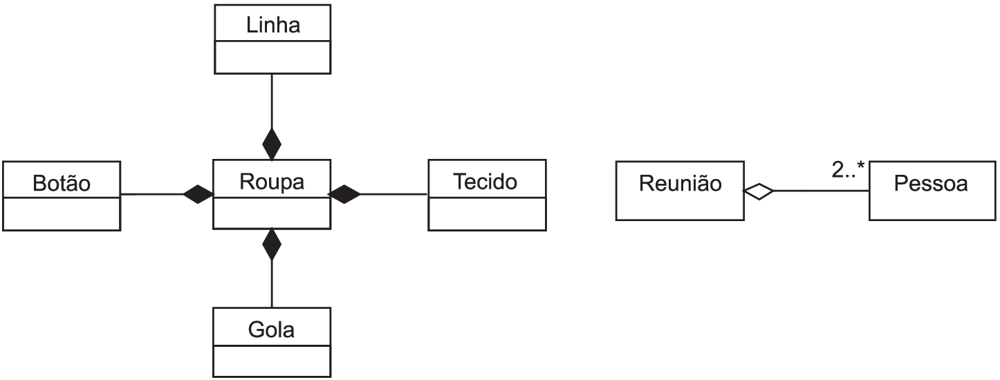

### Pacote

Se um modelo é composto de um conjunto relativamente pequeno de classes, então possivelmente até sejamos capazes de citar todas elas. Contudo, nem sempre o cenário é tão simples. Mesmo que seja, à medida que o tempo passar, outras classes serão criadas até o momento que será impossível gerenciar o imenso conjunto resultante.

Pacote é uma proposta que permite dividir classes em subconjuntos quando o conjunto delas não mais puder ser compreendido em sua totalidade pela mente humana. É desta forma que é possível usufruir da grande quantidade de recursos oferecidos por bibliotecas que acompanham linguagens de programação como VB.NET e Java, por exemplo.

Um pacote se assemelha a um escaninho. Se há organização, então existem vários escaninhos e cada um deles tem o seu propósito, o que resulta em um cenário onde encontrar uma classe desejada, por exemplo, é uma tarefa onde primeiro se identifica o pacote (escaninho) e, no interior deste, a classe de interesse.

Na figura abaixo vemos o pacote _ensino_. É natural procurar por uma classe _Estudante_ no pacote _ensino_. Contudo, a classe _NotaFiscal_ definitivamente não deveria fazer parte deste pacote. (Seria como colocar o delicioso marrom-glacê no mesmo compartimento dos produtos de higiene, junto com detergentes e o sabão neutro de coco em barra.)

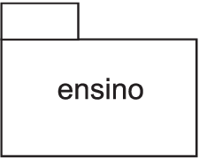

Em uma instituição de ensino será natural fragmentar o nosso modelo orientado a objetos, composto por dezenas de classes ou mais, em pacotes que representam componentes semânticos do problema. Por exemplo, aquilo que diretamente diz respeito ao ensino pode ser depositado em um pacote de nome _ensino_. Elementos gerais, por outro lado, podem ser depositados no pacote _escola_. Esta organização pode ser modelada conforme a figura abaixo ilustra.

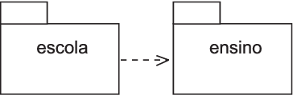

Nesta figura vemos dois pacotes. O pacote _escola_ depende do pacote _ensino_. Isto significa que uma mudança em _ensino_ pode provocar uma alteração em _escola_. Dependência é tema da seção seguinte. Aqui, o relevante é observar a divisão do nosso modelo em dois pacotes e que um deles depende do outro.

Embora nossa discussão tenha se restringido a pacote como um depósito de classes, um pacote pode conter qualquer outro elemento de uma modelagem, por exemplo, diagramas de interação e, inclusive, outros pacotes.

### Dependências

Uma dependência é um relacionamento no qual uma das partes é exigida para a especificação ou implementação da outra. Consequentemente, o elemento dependente deste relacionamente terá, provavelmente, que ser alterado quando ocorrer uma mudança no outro elemento. Por exemplo, na figura \ref{fig-uml-dependencia} a classe _Pessoa_ depende das classes _Data_ e \_String).

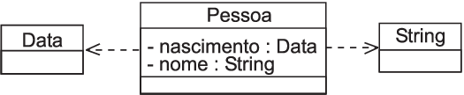

Embora o diagrama da figura \ref{fig-uml-dependencia} esteja correto, é mais comum encontrar a relação entre estas classes conforme a figura \ref{fig-uml-java-pds}. De fato, na versão à esquerda, apenas a classe _Pessoa_ esta presente. Quando se imagina que para um determinado contexto _Data_ e \_String) são conceitos periféricos, sem tanta relevância, é recomendado que não sejam representados como classes, conforme exibido no lado direito da figura \ref{fig-uml-java-pds}.

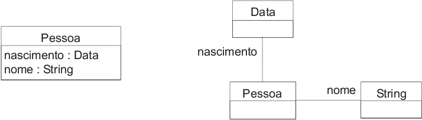

Outra alternativa, também válida, mas neste ponto reconhecido como uma proposta de menor qualidade, é a versão do lado direito. Neste caso optou-se por uma representação explícita de todas as classes. Observe que nesta versão são fornecidos os papéis. Por exemplo, a instância de _Data_ associada a uma instância de _Pessoa_ desempenha o papel de _nascimento_, conforme o diagrama. De forma análoga, a instância de _String_ desempenha o papel de _nome_.

Que não fiquem dúvidas: todas estas alternativas estão corretas. A versão da esquerda da figura abaixo oferece vantagens. Primeiro, não ressalta dependências entre classes de domínios diferentes. A classe _Pessoa_ é um conceito relevante do contexto. As classes _Data_ e _String_ são apenas acessórias. Por último, os relacionamentos ressaltados nos demais casos não acrescentam nenhuma informação relevante nem tornam o modelo mais atrativo e, portanto, podem ser preteridas em nome da simplicidade.

### Interface

O termo interface já foi empregado para designar a visão externa de uma classe. No âmbito da orientação a objetos, interface também é empregado para definir um contrato. Um contrato ou uma interface descreve serviços, que não são implementados pela interface, mas apenas especificados. Qual a utilidade de agrupar serviços em uma entidade denominada de interface que não os implementa?

A classe que faz uso de uma interface pode usufruir destes serviços sem depender de quem os implementa, o que assegura uma independência entre quem precisa dos serviços e quem os oferece. Em consequência, a implementação dos serviços pode ser alterada sem que ocorra alteração no cliente, desde que a interface (o contrato) seja mantido.

Outra vantagem seria oferecer implementações distintas para ambientes distintos. Uma interface que contém o serviço _abreArquivo_, por exemplo, possui uma implementação para o ambiente Linux distinta daquela de outros ambientes. Isto permite que a classe que faz uso deste serviço não precise ser modificada caso seja utilizada em outro ambiente distinto do Linux. Neste caso, apenas a implementação da interface terá que ser adequada para o novo ambiente.

Em resmo, através de uma interface um objeto pode requisitar o serviço oferecido por outro objeto sem que haja uma dependência explícita entre eles. De fato, apenas a classe do primeiro depende da interface, que pode possuir várias implementações.

A figura abaixo mostra a interface _Identificação_ contendo um único método. Observe o estereótipo <<_Interface_>> indicando que a notação de classe é para ser interpretada como uma interface. Alternativamente pode-se empregar a notação da direita. Esta última, contudo, não é tão adequada quanto a anterior quando se deseja especificar os serviços oferecidos pela interface.

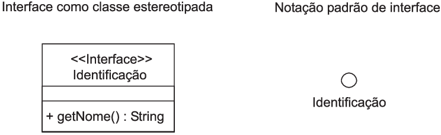

Qualquer classe que se propuser a implementar esta interface terá que implementar o método _gtNome_, que não recebe nenhum argumento como entrada e retorna uma _String_. Convém ressaltar que uma interface não oferece serviços, apenas os especifica, ou seja, este método só poderá ser usufruído com uma implementação que não é fornecida na interface. Em tempo, não é possível criar instâncias de interfaces!

Continuando nossos exemplos extraídos do meio de ensino, podemos estar interessados na identificação de uma avaliação ou instância da classe _Prova_, de tal forma que pudéssemos enviar a mensagem _gtNome_ para objetos desta classe. Para tal, indicamos, conforme a figura abaixo, que a classe _Prova_implementa a interface \_Identificação_.

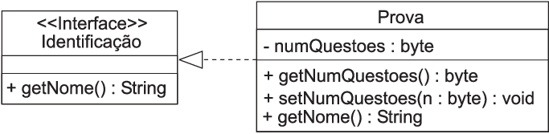

Embora a classe _Prova_não inclua explicitamente o método \_gtNome_, sabemos que o relacionamento entre esta classe e a interface _Identificação_ faz com que esta classe possua, entre seus métodos, uma implementação para _gtNome_ conforme descrito na interface.

Outro exemplo é apresentado na figura abaixo. A classe _Nota_ implementa a interface _Compara_, cujo único método _compareTo_, recebe como argumento uma instância de _Object_ e retorna um inteiro. A nota fornece a semântica do método. Em resumo, esta implementação torna possível ordenar instâncias de _Nota_, que não é um tipo primitivo conhecido e, em consequência, só quem o cria pode dizer se é possível ordernar valores deste tipo e, caso seja, como. A implementação deste modelo torna possível a ordenação de notas por algoritmos que sequer sabem o que uma nota significa.

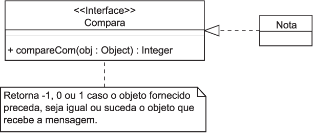

Suponha que você esteja interessado em implementar um algoritmo de ordenação baseado em comparações -- nem sempre é preciso fazer comparações para ordenar. Você também não gostaria que o seu algoritmo ordenasse apenas números inteiros, mas também valores em ponto flutuante, assim como as notas de alunos, referências bibliográficas com base no título destas referências e assim por diante.

Observe que para ordernarmos um conjunto de elementos não precisamos saber o que estamos ordenando, desde que seja possível obter dois elementos do conjunto que se deseja ordenar, quaisquer que sejam eles, e perguntar para um deles qual a relação com o outro. O que precisamos para isto? Dois itens: (a) um _array_ para guardar os elementos do conjunto que se deseja ordenar e (b) que as instâncias depositadas neste _array_ sejam de uma classe que implementa a interface _Compara_. Isto é suficiente!

A independência entre algoritmos de ordenação e elementos que se deseja ordenar é um grande benefício. Não apenas para este caso. O que se tornou independente foi a implementação de um serviço, neste caso, qualquer classe. Mesmo aquelas que ainda não foram construídas no momento em que você estiver lendo este texto poderão ser ordenadas por código já disponível. Afinal, este código depende apenas de uma interface e não de quem a implementa. Como ressaltar esta dependência? A figura abaixo ilustra uma classe que depende de e uma classe que implementa uma interface.

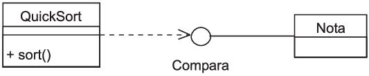

### Herança

Objeto é criado a partir da definição de uma classe, que reúne atributos e comportamentos. Herança é o mecanismo por meio do qual uma nova classe pode ser definida em função de outra existente. A nova classe estende a classe existente. A nova classe reutiliza a classe existente.

Os atributos e comportamentos de uma classe _Base_ tornam-se automaticamente disponíveis na classe _Derivada_ quando esta herda da anterior conforme ilustrado na figura \ref{fig-uml-heranca-simples}. Ou seja, _atributo_ e _metodo()_ também são membros de _Derivada_, herdados de _Base_. Outros termos comumente empregados para identificar as classes que participam deste relacionamento são ancestral/descendente e superclasse/subclasse.

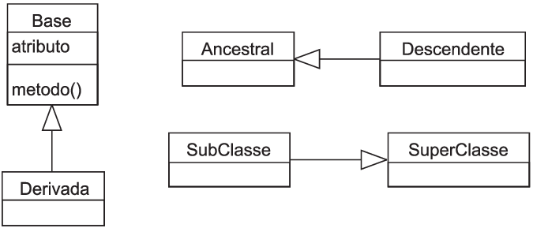

Uma subclasse pode substituir o comportamento fornecido na superclasse assim como também pode acrescentar outros atributos e comportamentos.

Observe o exemplo da figura abaixo. A classe _Pessoa_ representa um ser humano com data de nascimento, cor dos olhos e outros atributos, que foram omitidos por simplicidade. Todos os seus barulhentos vizinhos também são representados por instâncias desta classe. Você, contudo, estuda em uma universidade, é aluno. Da perspectiva orientada a objetos, um aluno pode ser representado por uma instância da classe _Aluno_.

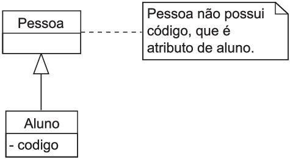

Queira você ou não, contudo, enquanto seres humanos você e seus vizinhos compartilham atributos. São todos seres humanos! Mas há motivo para orgulho: todo aluno possui um código. Um código só seu. Em toda a universidade não há outro igual. De fato, nem os seus vizinhos, nenhum deles possui este código que está associado a você. Este código é um atributo da classe _Aluno_. A classe _Pessoa_ não possui este atributo. Não poderia ser diferente, contudo, e quanto aos atributos em comum? Teremos que repetir toda a definição destes na classe _Aluno_? A resposta é não, desde que você faça uso de herança.

Ao fazer com que a classe _Aluno_ herde da classe _Pessoa_, todos os atributos e comportamentos de _Pessoa_ são herdados em _Aluno_. Ou seja, não será preciso redefini-los, não será preciso copiá-los. A herança estabelece um forte vínculo entre _Aluno_ e _Pessoa_. Quando uma instância de _Aluno_ for criada, esta instância poderá ser tratada como uma intância de _Pessoa_, afinal, todo aluno é uma pessoa, foi assim que foi modelado através da herança.

### Objeto

Objeto é uma entidade com a qual outros objetos trocam mensagens com o propósito de realizar determinada tarefa. Estas trocas de mensagens provocam mudanças nos estados destes objetos.
Em sistemas orientados a objetos, um objeto representa, em geral, uma entidade do mundo real.

Dessa forma, o "Fulano da Silva Sauro", seu amigo de infância, é representado por um objeto, uma instância da classe _Pessoa_. A figura abaixo fornece outros exemplos de entidades do mundo real e objetos correspondentes. Esta figura também introduz as notações que podem ser empregadas para se registrar objetos.

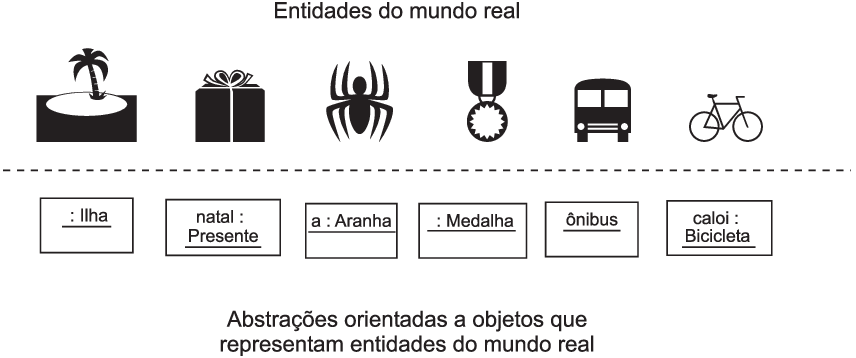

Da figura anterior é fácil reconhecer três formas básicas de registros de objetos mostradas na figura abaixo.

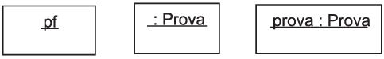

Em que casos é desejada a criação de diagramas contendo objetos? Um objeto é uma ilustração ou exemplo de uma entidade modelada de um sistema. Isto em um instante específico de tempo. Ou ainda, reflete uma possibilidade na qual o sistema modelado pode se encontrar em determinado instante. Em consequência, diagramas contendo objetos e ligações entre eles são mais empregados quando a complexidade das classes subjacentes exigir um modelo que ilustre instâncias destas classes em um instante de tempo.

Diagramas contendo objetos desempenham um papel ilustrativo. Detalhes como o valor de atributos, por exemplo, em geral são omitidos. Também convém ressaltar que um diagrama contendo objetos é obtido, necessariamente, de outros diagramas contendo classes e o relacionamento entre estas.

### Classe abstrata

Uma classe abstrata é uma classe a partir da qual não é possível criarmos
instâncias diretamente, mas apenas de forma indireta através da criação de
objetos de classes derivadas. De forma menos técnica, uma classe abstrata
pode ser empregada para representar um conceito para o qual possivelmente não
existe uma entidade no mundo real equivalente. Por exemplo, podemos dividir as
pessoas do mundo em dois grupos: aquelas físicas e aquelas jurídicas. Ou seja,
toda pessoa do mundo não é apenas uma pessoa, neste modelo, pois não existe
pessoa sem que esta seja física ou jurídica. O modelo da figura
abaixo ilustra este cenário.

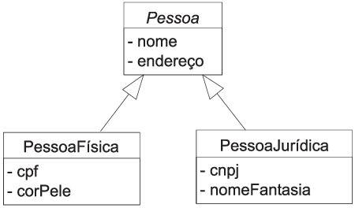

A classe _Pessoa_ contém dois atributos: _nome_ e
_endereço_. Toda pessoa, seja física ou jurídica possui tais atributos,
que são herdados pelas classes _PessoaFísica_ e
_PessoaJurídica_. Estas classes contemplam as especificidades das
entidades do mundo real que representam. Por exemplo, na primeira delas vê-se
o atributo _cpf_, enquanto na segunda o _cnpj_. Estas duas classes
são concretas, ou seja, delas podemos diretamente criar instâncias, pois
representam entidades que existem no mundo real e desejamos vê-las tratadas
via software. Por outro lado, a classe _Pessoa_ não possui correspondente
no mundo real conforme a intenção do modelo e, dessa forma, foi declarada
abstrata.

Classes abstratas também são empregadas em outros cenários com menos apelo
real e mais apelo computacional. O que denominamos de _frameworks_, por
exemplo, exige a existência de várias classes que são definidas por quem for
fazer uso desta ferramenta. De forma ainda mais geral, qualquer código que faz
uso de uma classe abstrata com o propósito de não impor uma implementação
específica da classe, mesmo porque isto pode ser impossível para quem escreve
este código. _Drivers_ que permitem o acesso a bancos de dados, por
exemplo, podem ocultar os detalhes de funcionamento de um banco de dados
através de classes abstratas que deverão ser implementadas pelo fabricante do
banco.
